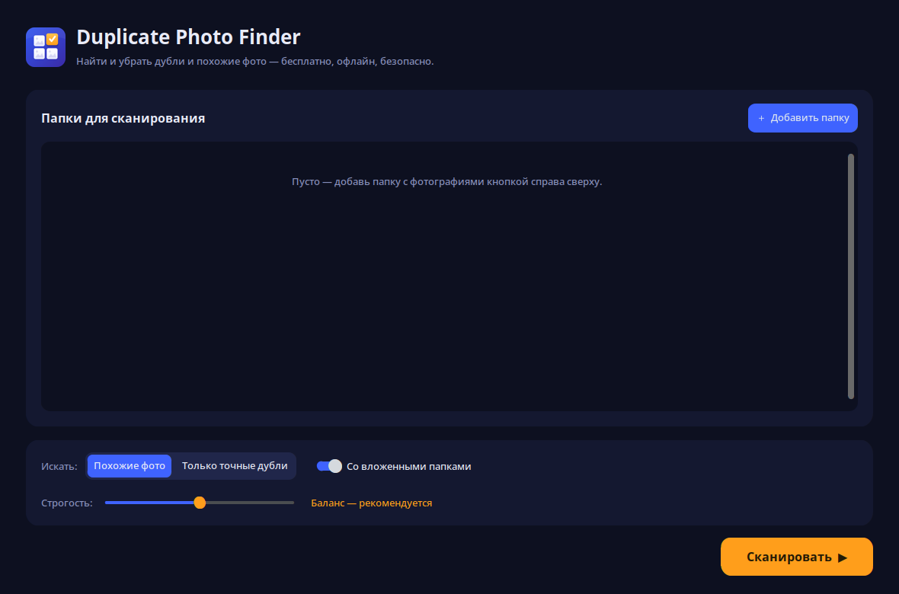
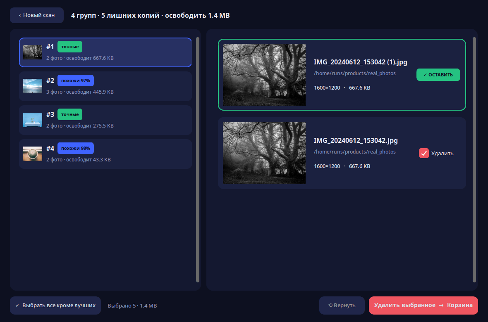
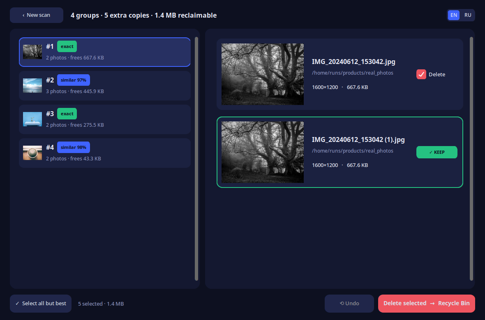

# Duplicate Photo Finder — Free Duplicate & Similar Photo Cleaner for Windows

🌐 **Official website: [duplicatephotofinderpc.com](https://duplicatephotofinderpc.com)** — download, screenshots & FAQ.

**Duplicate Photo Finder** is a **free, offline** Windows utility to **find and delete duplicate photos** — including
similar shots and camera bursts. Fast, small, and safe: files go to the **Recycle Bin**, never permanently deleted
without your confirmation.

Perfect for cleaning up years of vacation folders, phone backups, and unsorted image archives — get your disk space
back without losing memories.

## Features

- 🖼️ **Exact duplicates** — SHA-style hash funnel, catches identical photos byte-for-byte
- 🎯 **Similar photos & bursts** — perceptual hash finds near-duplicates (same shot, different exposure / edit)
- ⚡ **Fast on huge libraries** — parallel workers, cached results across runs
- 🗑️ **Safe delete** — files sent to Recycle Bin with **Undo**; nothing is nuked without you
- 🤝 **Keep the best** — auto-picks the sharpest / highest-resolution copy in each group
- 🌙 **Modern dark UI** — clean single-window app, sv-ttk theme
- 🆓 **Free & open source** — MIT licensed, zero ads, zero telemetry, no sign-up

## Screenshots

## How to use

1. Download and run the Windows installer.
2. Add one or more folders to scan (Downloads, Pictures, external drives).
3. Choose **Exact only** or **Similar + exact**.
4. Click **Scan** — grouped duplicates appear when done.
5. Review each group, keep the best or auto-pick — then **Move to Recycle Bin**.

## How to find and delete duplicate photos on Windows

Manually sorting duplicate pictures across `Pictures`, `Downloads`, and old backup folders is basically impossible
past a few thousand files. Duplicate Photo Finder walks your folders once, hashes each image in parallel, and
groups exact copies plus visually similar shots (same scene, different crop / edit / burst frame). You then
keep the best copy per group and send the rest to the Recycle Bin, so nothing is destroyed until you empty it.

## FAQ

**Is Duplicate Photo Finder free?**
Yes — free download, no trial limit, no locked features, no paid "Pro" tier. MIT-licensed open source.

**Is it safe?**
Yes. Files go to the Windows Recycle Bin. Nothing is permanently deleted without you emptying the bin.
Runs fully offline — no uploads, no accounts, no telemetry.

**Does it work on Windows 11?**
Yes — Windows 10 and Windows 11, x64.

**Does it find similar photos, not just exact duplicates?**
Yes. Toggle "Similar + exact" mode to detect near-identical shots (bursts, small edits, resaves).

**Does it delete Google Photos / iCloud copies?**
No — this is a local Windows utility. It scans folders on your PC only.

## Download

**Official website:** [duplicatephotofinderpc.com](https://duplicatephotofinderpc.com) — one-click download.

Latest Windows build from the [**Releases**](../../releases/latest) page.
Every release ships with a published **SHA-256** hash so you can verify the file before running it.

## Compatibility

Windows 10 and Windows 11 (x64).

## License

[MIT](LICENSE) — free for personal and commercial use.

---

*Keywords: duplicate photo finder, duplicate photo cleaner, duplicate photo remover, duplicate image finder,
find duplicate photos, delete duplicate photos, remove duplicate photos, similar photo finder, find similar photos,
awesome duplicate photo finder, free duplicate photos, windows 11 duplicate photos, photo deduplicator.*
