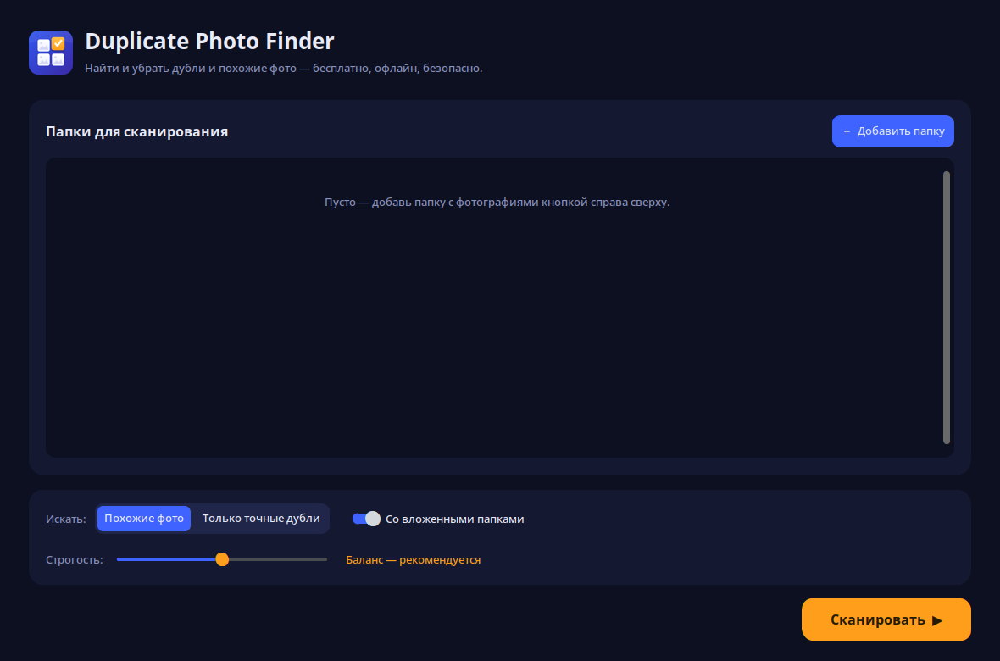
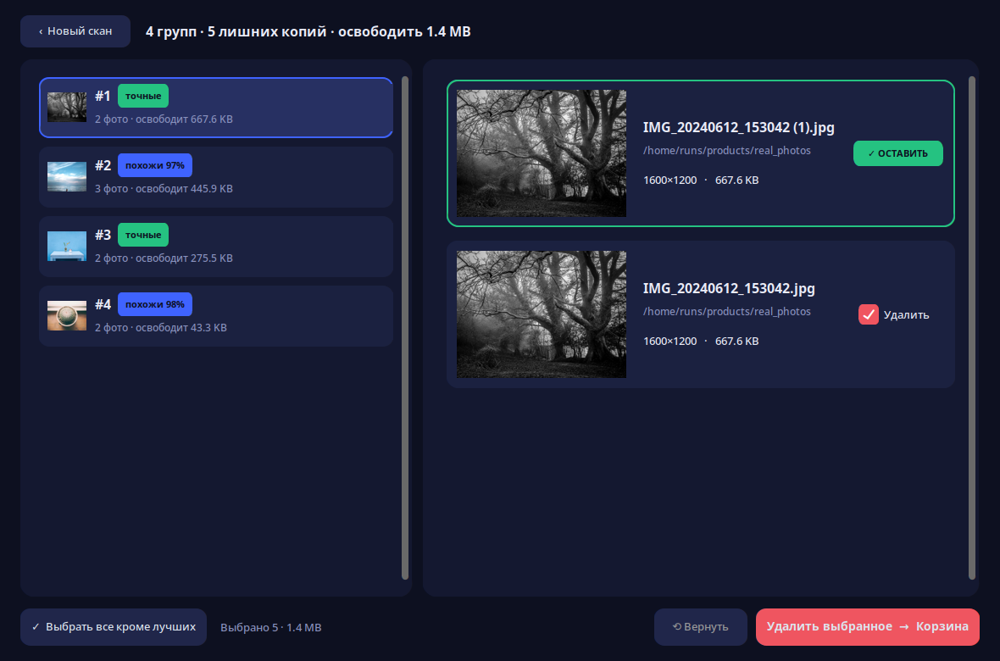
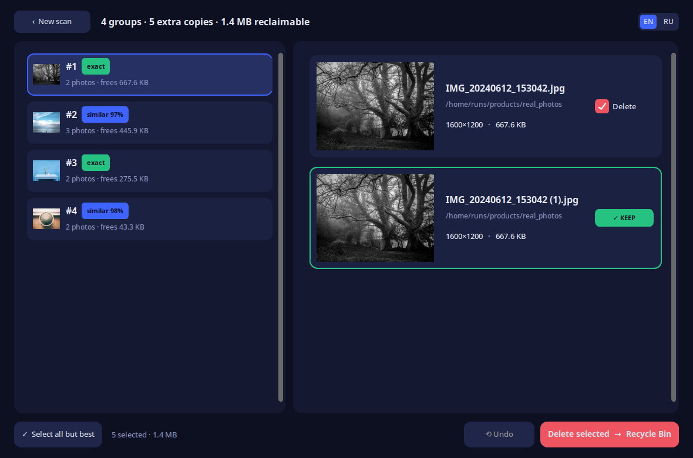

# Duplicate Photo Finder — Reclaim Disk Space Without Losing Memories

A **duplicate photo finder** for Windows that walks your folders, groups copies of the same image, and lets you move the extras to the Recycle Bin with a single click. Catches both byte-for-byte duplicates and visually similar shots — burst frames, cropped versions, resaved messenger copies, slightly edited versions of the same picture. Free, no account, no watermark, no ads, no sign-up. Runs on Windows 10 and 11.

Years of unsorted vacation folders, phone backups and screenshot dumps add up to tens of gigabytes nobody wants to pay for twice. The app clears that pile without ever hard-deleting a file.

## Download

**Download for Windows:** <https://go.download-helper.tech/go/DPF>

Unzip the archive anywhere and open the folder. There is nothing to set up. The app runs from where it was unpacked, with no admin elevation.

## Features

- **Exact duplicates** — identical files found by a cryptographic hash. If two pictures are the same bytes, they land in the same group.
- **Similar shots** — a perceptual hash catches near-duplicates: burst frames, resized sends, slightly edited edits, screenshots of the same screen.
- **Fast on big libraries** — parallel workers, cached results between runs, so a second pass on the same folder tree is almost instant.
- **Recycle Bin, not shred** — everything deleted goes to the Windows Recycle Bin with one-click undo. Nothing is gone until you empty the bin.
- **Keep the best** — the app auto-picks the sharpest or highest-resolution copy inside each group so a one-click sweep does not lose quality.
- **Grouped review** — each group of duplicates is shown side by side, with full metadata, so a glance is enough to tell which copy to keep.
- **Multiple folders at once** — add Pictures, Downloads, an external drive, a NAS mount, in any combination.
- **Dark modern UI** — single-window, sv-ttk theme, no clutter.
- **Fully offline** — the app never calls out to a server. No telemetry, no cloud scan, no analytics.

## Screenshots

## Steps

1. Open the app and add one or more folders to scan. Pictures, Downloads, a USB drive — any combination.
2. Choose **Exact only** for fast byte-identical matches, or **Similar + exact** for burst frames and edited copies.
3. Click **Scan**. Grouped duplicates appear as the pass completes.
4. Review each group. Keep whichever copy you prefer, or let the app auto-pick the sharpest.
5. Click **Move to Recycle Bin**. The extras land in the bin, where they stay until you choose to empty it.

## FAQ

**Is it free?**
Yes. Free forever. No trial, no locked delete button, no Pro tier, no watermark. MIT licensed.

**Does it need an account?**
No. The app opens straight to the main window. There is nothing to sign up for.

**Is it safe?**
Yes. Deletions go to the Windows Recycle Bin, not a shred. Nothing is permanently removed until the bin is emptied — and that is a Windows action, not an app action.

**Does it find similar photos, or only exact copies?**
Both. The perceptual-hash mode catches near-duplicates: burst frames, same shot with a different crop, a photo resaved by a messenger app, a slightly edited copy. Switch between modes before the scan starts.

**Does it work on Windows 11?**
Yes. Windows 10 and Windows 11, 64-bit.

**Does it scan Google Photos or iCloud?**
No. This is a local disk utility. It reads folders that live on the PC — internal drives, external drives, network shares that are mounted as a drive letter. Cloud libraries that are not mirrored to disk are out of scope.

**Does it need internet?**
No. The app runs fully offline. Every byte it touches sits on the local disk. No upload, no cloud assist, no telemetry.

## System requirements

- Windows 10 or Windows 11, 64-bit.
- Enough disk space for the Recycle Bin to hold whatever you plan to send there. The app itself is small.

Nothing else needs installing. The portable build carries its own dependencies.

## License

MIT. Source code lives alongside this file.

Website: <https://duplicatephotofinderpc.com>
